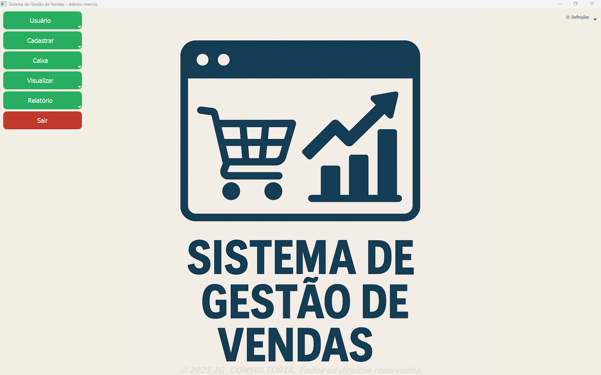
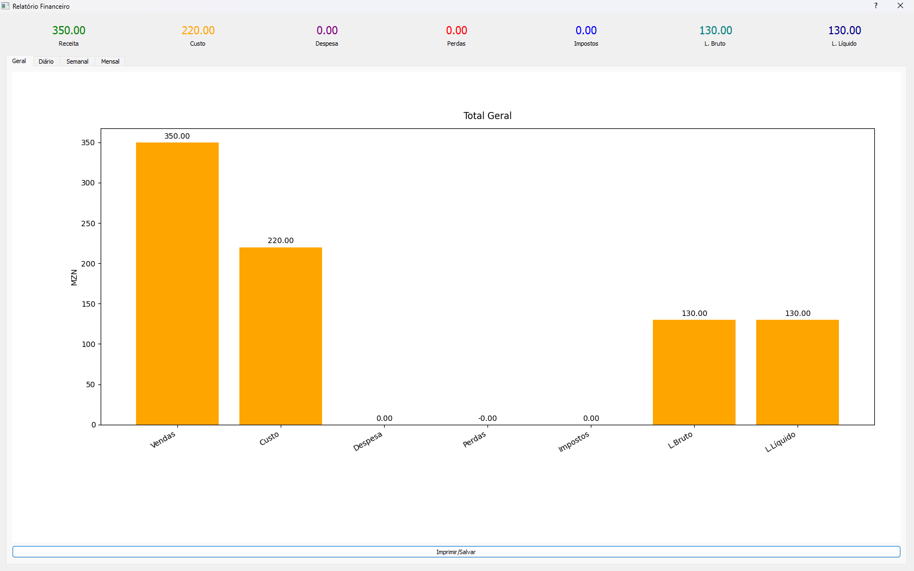
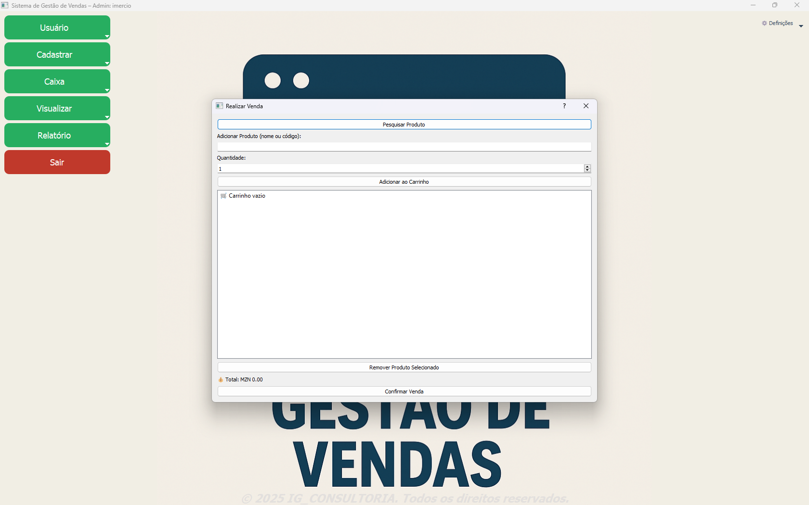

# 🛒 Sistema de Gestão de Vendas

Sistema de gestão de vendas desenvolvido por **Imércio Gaspar Ngale**, voltado para pequenos comércios que precisam de uma solução local, prática e eficiente. O sistema oferece controle completo de produtos, vendas, usuários e estoque, com relatórios visuais e integração com hardware.

---

## 🧩 Funcionalidades

- Cadastro de usuários com controle de acesso  
- Cadastro de produtos com código de barras, fornecedores e data de validade  
- Atualização e visualização de estoque com:
  - Total em estoque por produto
  - Produtos vencidos
  - Produtos prestes a vencer  
- Registro de vendas com:
  - Cálculo automático
  - Alerta de estoque baixo ao realizar venda
  - Leitura de código de barras via scanner USB
  - Impressão de recibos em impressoras térmicas  
- Interface gráfica com PyQt5  
- Banco de dados embutido com SQLite (sem necessidade de servidor)  
- Relatórios financeiros de vendas geral e por período:
  - Diário, semanal e mensal
  - Gráficos gerais de desempenho  
- Histórico de vendas:
  - Tabela detalhada com produtos vendidos, quantidades e totais
  - Gráfico dos produtos mais vendidos  
- Geração de relatórios em PDF com paginação e imagens proporcionais  

---

## 📊 Relatórios Visuais

- 📅 Gráficos por período: vendas diárias, semanais e mensais  
- 📦 Histórico de vendas: tabela e gráfico dos produtos mais vendidos  
- 🧮 Estoque:
  - Total por produto
  - Produtos vencidos e prestes a vencer
  - Alerta de estoque baixo  

---

## 🖼️ Capturas de Tela

### Tela Principal  


### Relatório de Vendas  


### Tela de Venda  


---

## 🛠️ Tecnologias Utilizadas

- Python 3.x  
- PyQt5  
- SQLite  
- Matplotlib (gráficos)  
- ReportLab (PDFs)  
- Impressoras térmicas USB  
- Leitores de código de barras  

---

## 📦 Instalação

Clone o repositório:

```bash
git clone https://github.com/864742710/sistema-gestao-vendas.git
cd sistema-gestao-vendas
